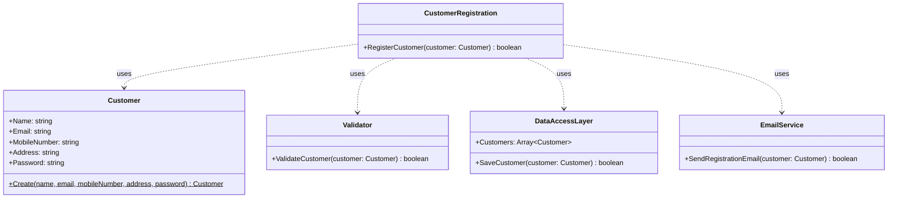

```mermaid
classDiagram
  class Customer {
    +Name: string
    +Email: string
    +MobileNumber: string
    +Address: string
    +Password: string
    +Create(name, email, mobileNumber, address, password)$ Customer
  }
  class Validator {
    +ValidateCustomer(customer: Customer) boolean
  }
  class DataAccessLayer {
    +Customers: Array~Customer~
    +SaveCustomer(customer: Customer) boolean
  }
  class EmailService {
    +SendRegistrationEmail(customer: Customer) boolean
  }
  class CustomerRegistration {
    +RegisterCustomer(customer: Customer) boolean
  }

  CustomerRegistration ..> Customer : uses
  CustomerRegistration ..> Validator : uses
  CustomerRegistration ..> DataAccessLayer : uses
  CustomerRegistration ..> EmailService : uses
```
