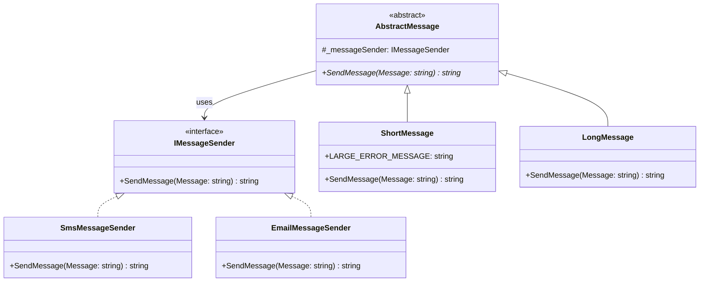

```mermaid
classDiagram
  class IMessageSender {
    <<interface>>
    +SendMessage(Message: string) string
  }
  class SmsMessageSender {
    +SendMessage(Message: string) string
  }
  class EmailMessageSender {
    +SendMessage(Message: string) string
  }
  class AbstractMessage {
    <<abstract>>
    #_messageSender: IMessageSender
    +SendMessage(Message: string)* string
  }
  class ShortMessage {
    +LARGE_ERROR_MESSAGE: string
    +SendMessage(Message: string) string
  }
  class LongMessage {
    +SendMessage(Message: string) string
  }

  IMessageSender <|.. SmsMessageSender
  IMessageSender <|.. EmailMessageSender
  AbstractMessage <|-- ShortMessage
  AbstractMessage <|-- LongMessage
  AbstractMessage --> IMessageSender : uses
```
